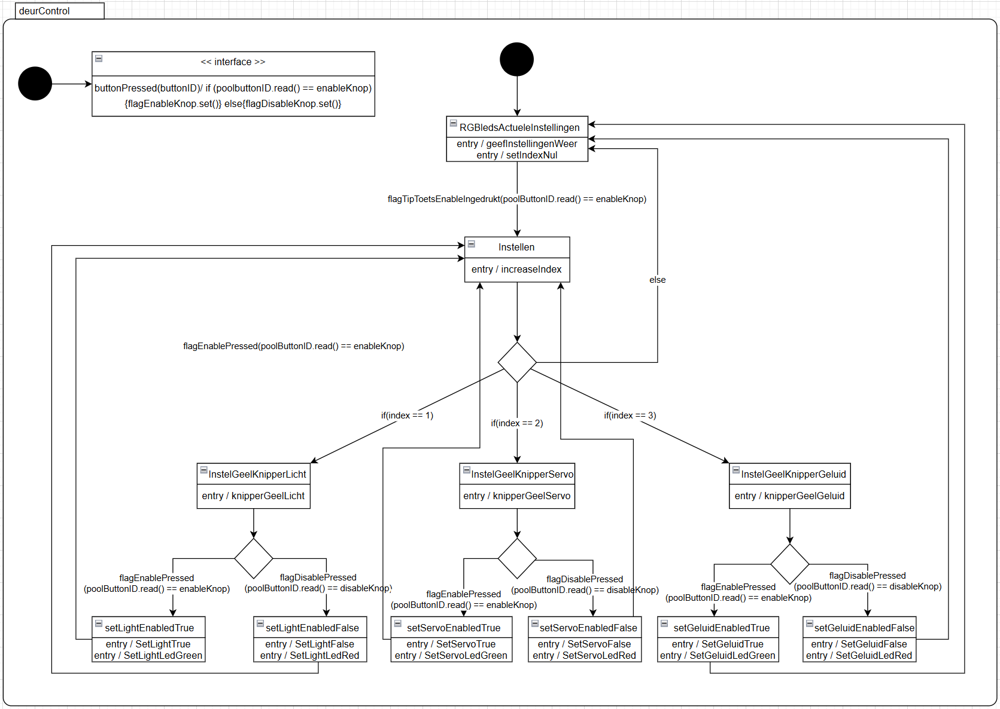

Bij deze opdracht heb ik een klassediagram en een use case beschrijving gebruikt om een STD van het systeem te maken. Het syteem is best complex en ik verwacht dat dingen op een simpelere en logischere manier gedaan zouden kunnen worden, maar ik heb hier heel veel tijd in gestoken en ik ben blij met dit resultaat voor nu.
