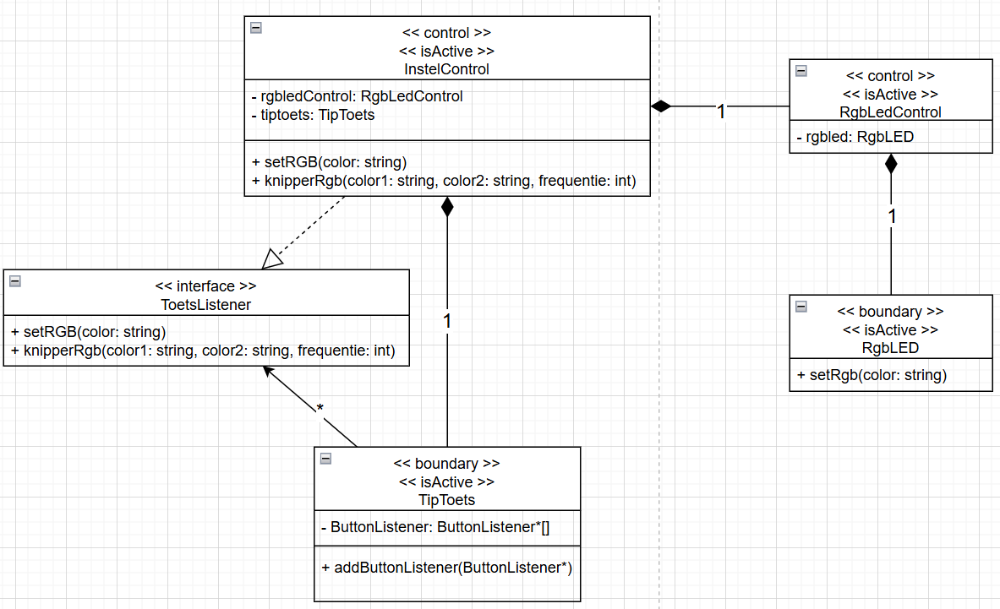
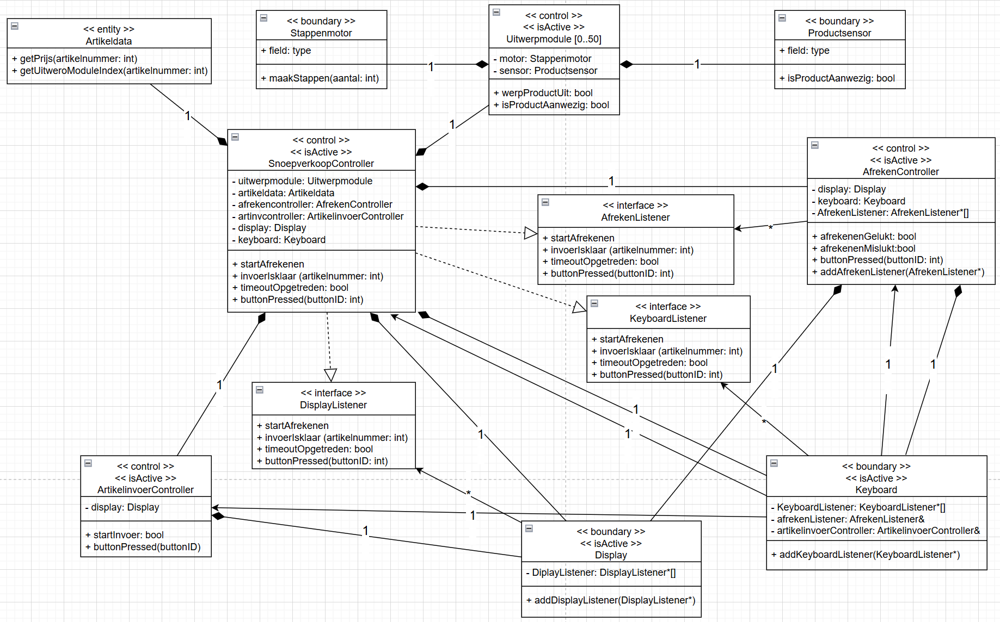

Voor deze opdracht heb ik twee object modellen van marius gebruikt om er klassediagrammen van te maken. Om er klassediagrammen van te maken heb ik het Design like a robot pdf gebruikt om de stappen te volgen voor het maken van een klassediagram. Het duivenschreck object model was vrij simpel dus die was niet zo lastig, het snoepautomaat object model was veel complexer en was ik veel minder zeker of het goed was hoe ik hem gemaakt had.

Hier het klassediagram van het duivenschreck systeem:

Hier het klassediagram van het snoepautomaat systeem:
