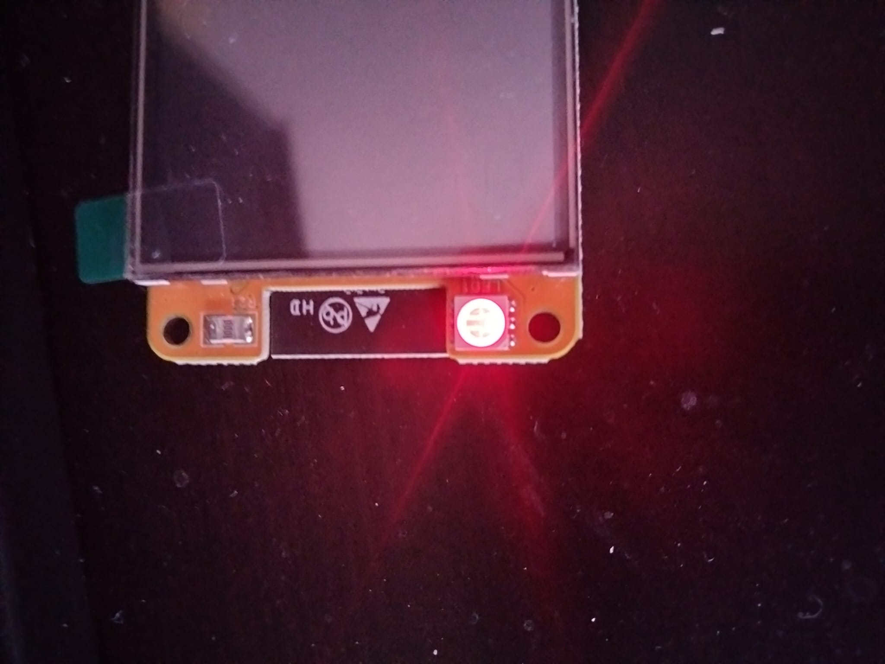

Snap je waarom de gpio.h op meerdere plekken staat?
Ik denk hij op meerdere plekken staat, omdat meerdere programma's zoals, python, vscode en arduino allemaal gpio pins moeten kunnen gebruiken en daar hebben ze een gpio.h file voor nodig.

Wat zouden de verschillen tussen de versies zijn?
Elk programma heeft zijn eigen versie nodig van de file zodat het voor vscode of python of iets anders kan werken, de benaming in de files zullen ook verschillen.

sommige draagbare operating system hebben ook een hardware abstraction layer (HAL). besturingssystemen zoal Linux, hebben de mogelijkheid om een HAL in te voegen. Het NetBSD-besturingssysteem heeft een schone hardware-abstragelaag die het draagbaar maakt. Onderdelen van dit systeem zijn uvm(9)/pmap(9), bus_space(9), bus_dma(9) en andere subsystemen. Populaire buses die op meer dan één architectuur worden gebruikt, zijn ook geabstraheerd, zoals ISA, EISA, PCI, PCIe, enzovoort, waardoor stuurprogramma's ook zeer draagbaar zijn met een minimum aan codewijzigingen. Besturingssystemen met een HAL zijn makkelijk draagbaar over verschillende hardware. Dit is vooral belangrijk voor embedded systemen. HAL is een code laag dat er voor zorgt dat je meer communicatie tussen software en hardware in een systeem kan doen. het word door sommige besturingssystemen gebruikt in verschillende applicaties. 

