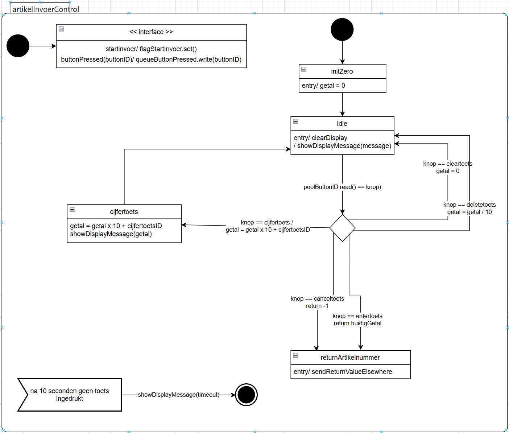

Bij de opdracht STD snoepautomaat ArtikelInvoerControl heb ik wat feedbackk van mijn groepsgenoot Ryan gekregen om bepaalde onlogische dingen te veranderen, zoals dat ik onnodige states had. Ik ben uiteindelijk op deze std uitgekomen. De knoppen cancel en enter zorgen er eigenlijk voor dat het naar een andere state doorgaat die niet in de use case aangegeven is dus eindigt het hier bij een grotere state. 

