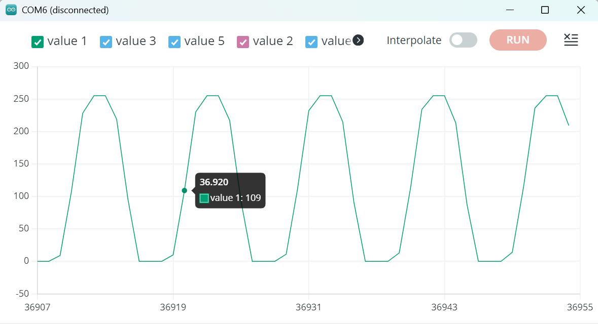

Bij deze opdracht heb ik de code van de github gekopiëerd en in de Arduino IDE geplakt. Ik moest hulp vragen aan Laurens, omdat ik niet goede informatie kreeg in de serial plotter en monitor. Het bleek dat de baudrate veel hoger moest zijn dan ik dacht, maar er stond in de opdracht helemaal niet welke baudrate ik nodig had. Uiteindelijk leek een baudrate van 115200 wel informatie te geven en kreeg ik ook een sinus vorm. Ik hield een draadje in de A0 pin bij een wandcontact door maar de sinus vorm veranderde niet

Dit is het resultaat:
