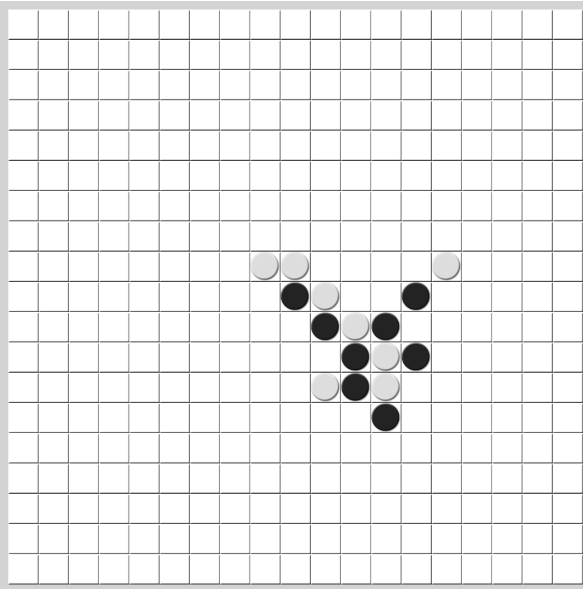
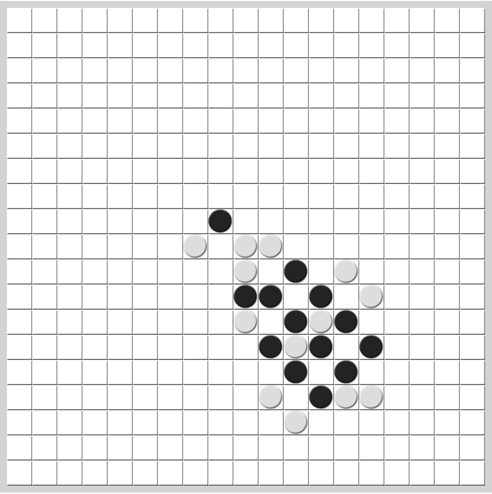
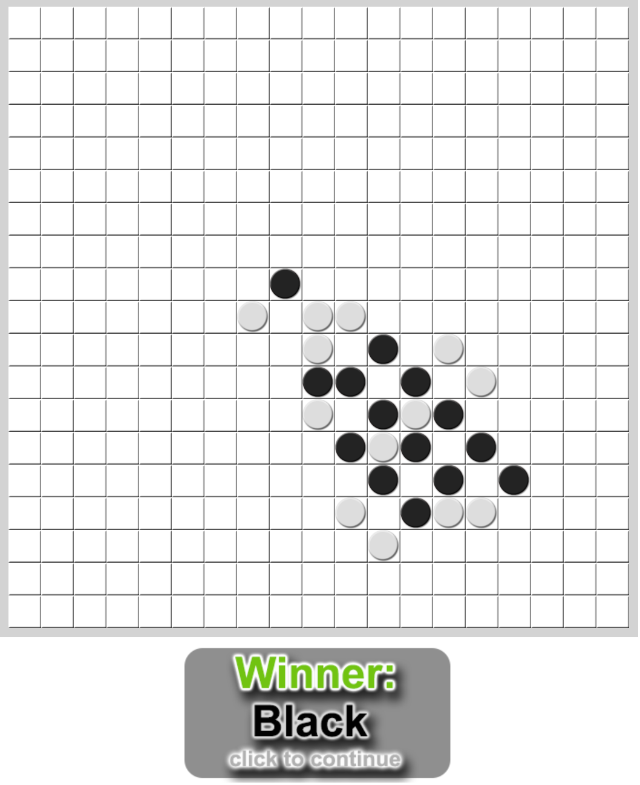

Bij het maken van deze opdracht heb ik deze links op canvas gevolgd:

https://github.com/HU-TI-DEV/TI-S3/blob/main/infrastructuur/Azure_Virtual_Machine/README.md

https://github.com/HU-TI-DEV/TI-S3/blob/main/infrastructuur/Azure_Virtual_Machine/Docker_on_Ubuntu.md

https://github.com/HU-TI-DEV/TI-S3/blob/main/infrastructuur/Azure_Virtual_Machine/Docker_Compose_on_Ubuntu.md

https://github.com/HU-TI-DEV/TI-S3/blob/main/infrastructuur/ServerMetWebApplicatie/Gomoku_on_Ubuntu.md

Ik merkte dat mijn credit voor de microsoft azure server op was dus had ik hulp van Harm en van Nathaniël een klasgenoot om ubuntu te installeren en de gomoku virtualbox goed op te stellen. Verder heb ik alle commands in de virtualbox cmd gerunt en met nog wat hulp van een andere klasgenoot om de gomoku game te spelen werden de instellingen aangepast en nu werkt het.

Hier een mid-game afbeelding dat de ai van Marius van mij wint.

En ook dat ik van de ai van Marius win:

